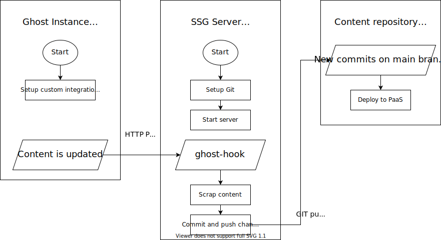

# ghost-ssg

Static Site Generator\* setup for [Ghost](https://ghost.org/), using a Git repository for the generated content

<small>\* Actually it just scrapes the Ghost instance, cause, you know, Ghost already generates the HTML on server side by default.</small>

## Motivation

Ghost is really cool as-is, but I really wanted to have some way to deploy it to one of cool [PaaS](https://en.wikipedia.org/wiki/Platform_as_a_service) we have today (like [Vercel](https://vercel.com/), [Netlify](https://www.netlify.com/)...) to have better loading times taking advantage of the amazing CDN networks they have (plus cheap computation power thanks to serverless functions if needed).

While there are some cool projects to actually run the whole Ghost instance in a serverless environment such as AWS Lambda, they are quite tricky and not officially supported, and I didn't want anything too complicated to maintain in the long term. Additionally, I wanted to have some way to keep a history of the content in case something goes wrong.

## Quick start

1. You must have `docker` and `docker-compose` installed
1. Create a `.env` file with the required env variables (see `.env.example` for reference)
1. Run `docker-compose up`
1. Your Ghost instance should be available on whatever port you've chosen (http://localhost:8080 by default)
1. Setup the blog and do some changes (e.g. edit a post/create a new one/whatever)
1. Yay! Your content repository should have a new commit with the generated HTML 🚀✨

## How it works

There are three services in the `docker-compose` file:

### Ghost

The Ghost service, using the Docker Official image. The only thing changed here is some additional config in the fixtures.json file to setup a custom integration with the SSG server when the service is started.

### MySQL

Used as a better storage backend for Ghost, but could be swapped out and go back to using SQLite as Ghost does by default.

### SSG

The actual magic happens here. This service spins up a single endpoint that it's set up as a web hook in the custom integration created in Ghost, so whenever anything is changed there (a post is created/edited/deleted, some preference is changed, etc) this is called.

Then, some bash scripts are executed to crawl the Ghost instance and download everything. It finally commits the changes into the configured repository and pushes them so they can be deployed (using some PaaS as said earlier or even something custom using for example Github Actions - that's up to you)
